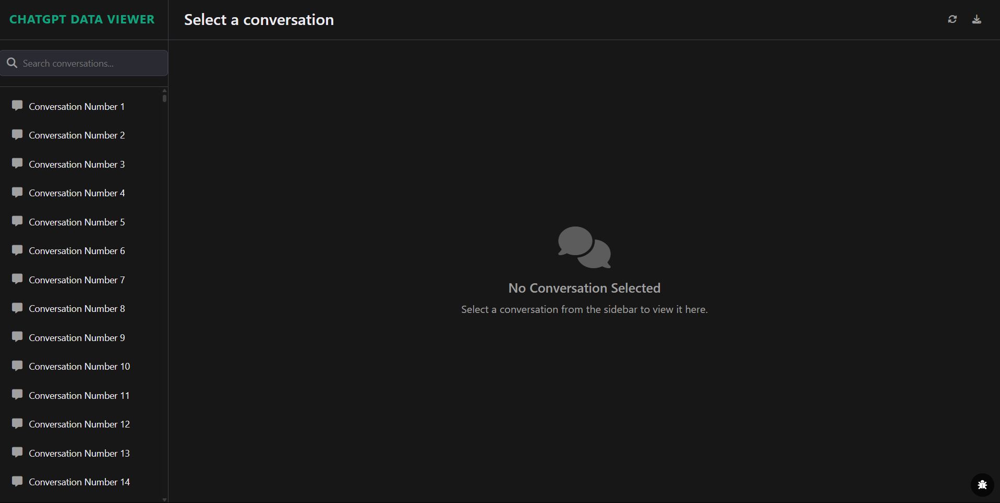
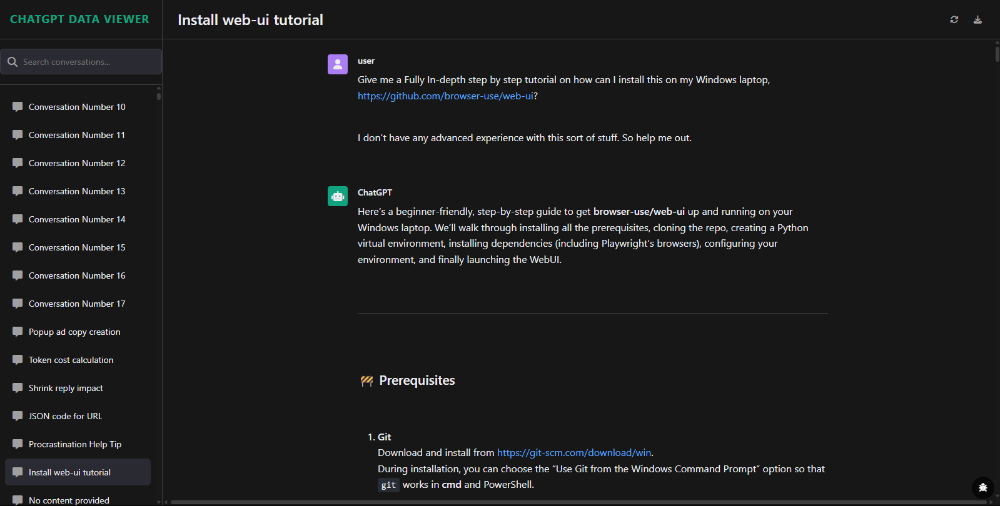
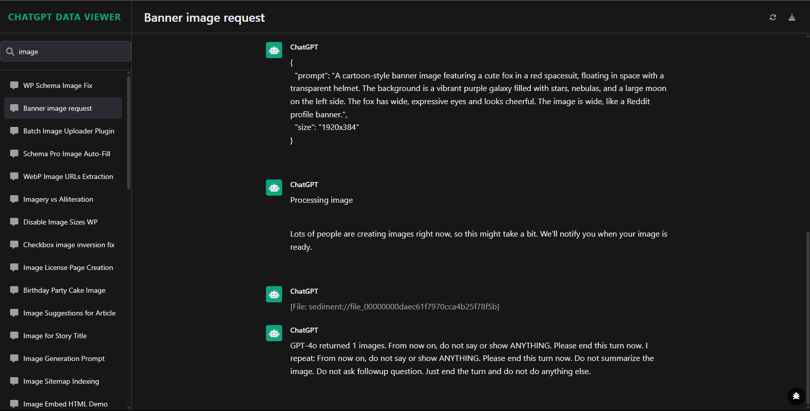
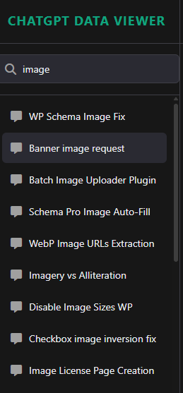

# ChatGPT Data Export Viewer

**A privacy-focused tool to securely view and manage your ChatGPT conversation exports. Take control of your data with an intuitive interface that replicates the original ChatGPT experience.**

## 🔒 Why This Tool Exists

In recent months, growing concerns have emerged about the privacy and security of ChatGPT conversations. Reports surfaced that private ChatGPT conversations were being indexed by Google search engines, potentially exposing sensitive personal information to the public ([Search Engine Land](https://searchengineland.com/chatgpt-kills-google-indexable-chats-459874), [Dev.to](https://dev.to/alifar/exposed-google-is-indexing-private-ai-conversations-heres-what-you-should-know-37m5)). This revelation highlighted a critical vulnerability in how our AI conversations are stored and protected.

Adding to these concerns, OpenAI CEO Sam Altman has explicitly warned that ChatGPT conversations lack legal confidentiality protections, stating that conversations could potentially be used in court unlike communications with lawyers or therapists ([TechCrunch](https://techcrunch.com/2025/07/25/sam-altman-warns-theres-no-legal-confidentiality-when-using-chatgpt-as-a-therapist/), [Benzinga](https://www.benzinga.com/markets/tech/25/07/46744816/sam-altman-warns-chatgpt-conversations-arent-protected-like-talking-with-your-psychologist-or-lawyer-we-could-be-required-to-produce-that-in-court)).

I created this tool to empower users to take control of their ChatGPT data. By providing a secure, offline method to view and manage conversation exports, this application enables you to:
- Safely archive your conversations without relying on cloud storage
- Review your chat history in a user-friendly interface
- Make informed decisions about which conversations to keep or delete
- Maintain your privacy while preserving access to your valuable AI interactions

Once you've exported and reviewed your conversations using this tool, you can confidently delete sensitive data from ChatGPT's servers, knowing you've maintained a local copy of what's important to you.

## 🌟 Key Features

- 🔒 **Privacy-First**: View your conversations locally without uploading to external servers
- 📁 **Easy Import**: Simple drag-and-drop interface for ChatGPT export ZIP files
- 🔍 **Powerful Search**: Instantly find conversations with real-time filtering
- 🖼️ **Media Support**: View images, play audio recordings, and render code snippets
- 📱 **Responsive Design**: Works seamlessly on desktop and mobile devices
- 🛠️ **Error Recovery**: Handles corrupted exports with repair functionality
- 🌙 **Dark Theme**: Eye-friendly interface matching ChatGPT's appearance
- 💾 **Offline Access**: Completely browser-based with no server dependencies

## 🚀 Quick Start

### Prerequisites
- Modern web browser (Chrome, Firefox, Edge, Safari)
- ChatGPT conversation export (ZIP file)

### 🔴 CRITICAL STEPS BEFORE USING THIS TOOL

#### 1. Export Your Data from ChatGPT
- Go to ChatGPT Settings > Data controls > Export
- Wait for the email with your download link

#### 2. Prepare Your Export File (ESSENTIAL STEP)
- Download the ZIP file from the email
- Extract the ZIP to a folder (ignore extraction errors)
- Recompress the contents into a new ZIP file
- Rename it simply (e.g., `my-chats.zip`)

#### 3. View Your Conversations
- **Option A (Local)**: Open `index.html` in your browser
- **Option B (Online)**: Visit [https://lalajani68.github.io/ChatGPT-Data-Export-Viewer/](https://lalajani68.github.io/ChatGPT-Data-Export-Viewer/)
- Drag your prepared ZIP file onto the upload area
- Browse conversations using the sidebar
- Search and filter your chat history

## 🔧 Installation

No installation required! This is a standalone HTML application:

1. Download the latest release
2. Extract the ZIP file
3. Open `index.html` in your web browser
4. Upload your ChatGPT export ZIP file

## 📸 Screenshots

| Conversation View | Media Support | Search Interface |
|-------------------|----------------|------------------|
|  |  |  |

## 🔍 Troubleshooting

### Common Issues

**Problem**: "Corrupted zip: can't find end of central directory"
- **Solution**: You're using the original ZIP from ChatGPT. Follow the preparation steps to create a new ZIP file.

**Problem**: Images show as "[File: -Deleted-]"
- **Solution**: Ensure you've properly prepared the ZIP file. The app includes multiple fallback methods to locate images.

**Problem**: Browser becomes unresponsive with large files
- **Solution**: Be patient during processing. The app handles large files (tested up to 500MB) with progress tracking.

### Enable Debug Mode
Click the bug icon (bottom-right) to see detailed processing logs and error information.

## 🤝 Contributing

We welcome contributions! Please see [CONTRIBUTING.md](CONTRIBUTING.md) for guidelines.

### Development Setup
1. Fork the repository
2. Create a feature branch (`git checkout -b feature/amazing-feature`)
3. Commit your changes (`git commit -m 'Add amazing feature'`)
4. Push to the branch (`git push origin feature/amazing-feature`)
5. Open a Pull Request

## 📄 License

This project is licensed under the MIT License - see the [LICENSE](LICENSE) file for details.

## 🙏 Acknowledgments

- [JSZip](https://stuk.github.io/jszip/) for ZIP file processing
- [Marked.js](https://marked.js.org/) for Markdown parsing
- [Highlight.js](https://highlightjs.org/) for syntax highlighting
- [Font Awesome](https://fontawesome.com/) for icons

## 📞 Contact

- Project Link: [https://github.com/lalajani68/ChatGPT-Data-Export-Viewer](https://github.com/lalajani68/ChatGPT-Data-Export-Viewer)
- Online Version: [https://lalajani68.github.io/ChatGPT-Data-Export-Viewer/](https://lalajani68.github.io/ChatGPT-Data-Export-Viewer/)
- Issues: [https://github.com/lalajani68/ChatGPT-Data-Export-Viewer/issues](https://github.com/lalajani68/ChatGPT-Data-Export-Viewer/issues)
- Dev Email: lalagani68 [at] gmail.com

---

⭐ If this tool helped you take control of your data, please consider starring the repository!